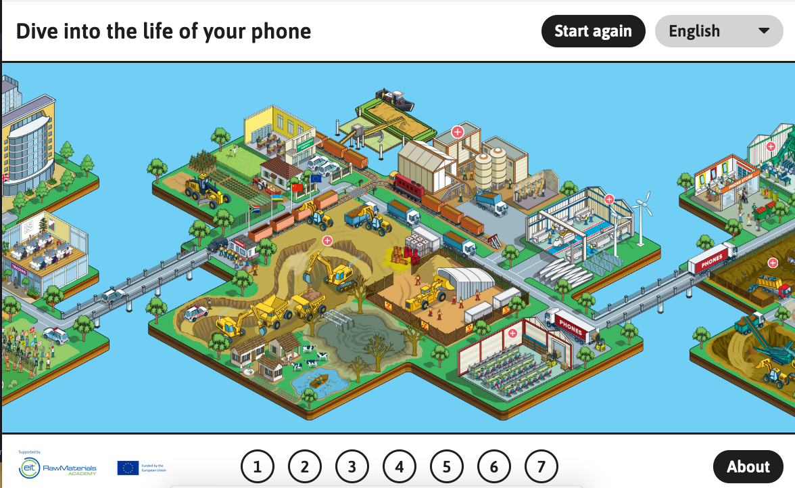

# Reuse City

! Important note (14.04.2021): This document has moved to a [different repository](https://github.com/reuse-city/lab/). Any information below may be outdated or obsolete.

## References

### Materials Matter

> The website takes us through the different stages of a phone’s life from mining, to processing and assembly, to reuse/recycling. And we introduce the idea that critical raw materials are doubly important as they are needed for scaling up renewable energy.

[materialsmatter.eu](https://materialsmatter.eu/)
