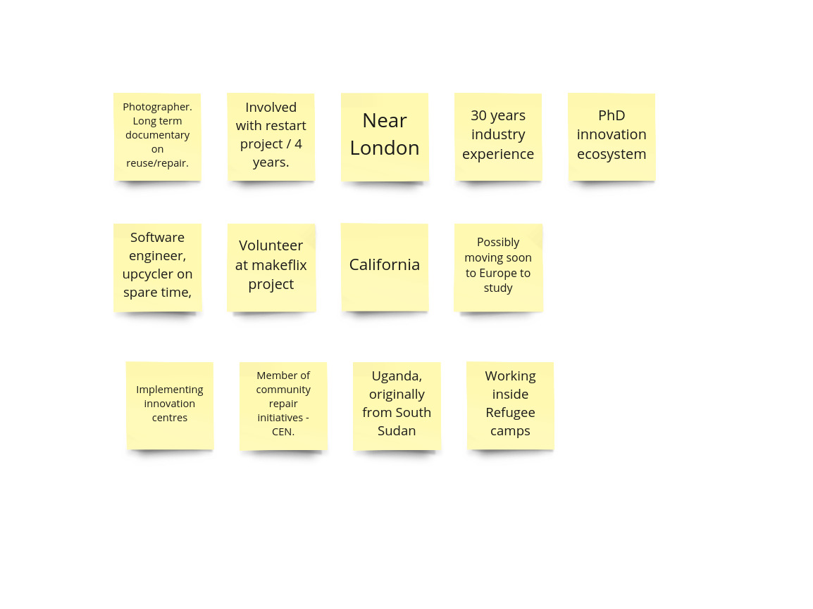
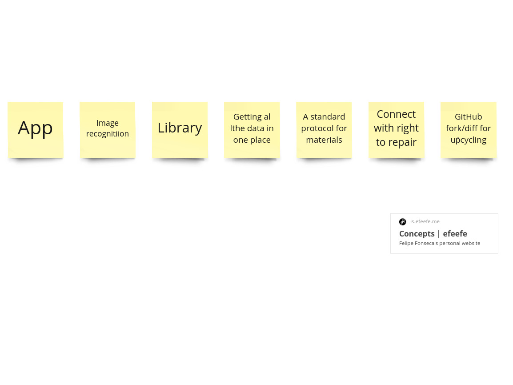

# Meeting - 09.04.2021

## Notes

3 participants.

- Tactile, hands-on education
- Educate the wider public on possibilities
- Reuse centres / Fablabs
- Master / apprentice
- Remote repair cafes
- Storage to collect stuff
- Tools. Tool libraries.
- Helsinki - people bring stuff to reuse centres. Senior repairer has final word.

- Standard / protocol instead of central database
- Connect with the right to repairer
- GitHub logic (fork / diff)
