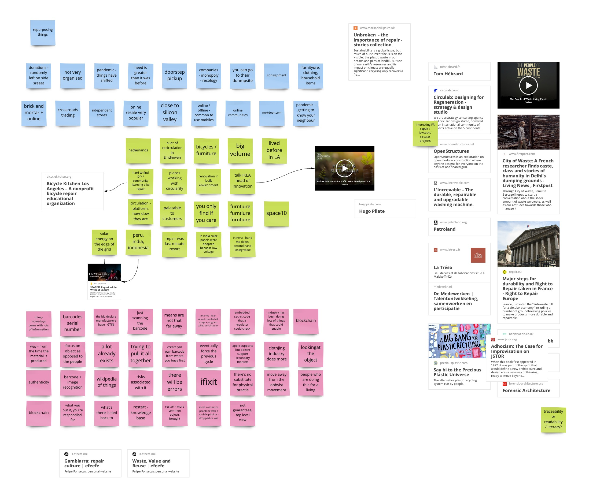

# Meeting - 16.04.2021

We met Friday afternoon (CEST). Three participants (NL, UK, US).

## Notes
- Local repair shop
- Ghana - virtually everything will be reused
- first repair, then sell, then scavenge for parts.
- Hard to find repair/reuse in the US (gave up making pictures in NY; bike repair workshop inaccessible in LA)
- Helsinki - almost industrial vs Havana - side-of-the-road workshops, oral culture 

FF notes, kept for later (not willing to interrupt much): Nantes, Stories. Last session on 13.4: trust.

- EU - descentralized / centralized policy. systems.
- Companies 

