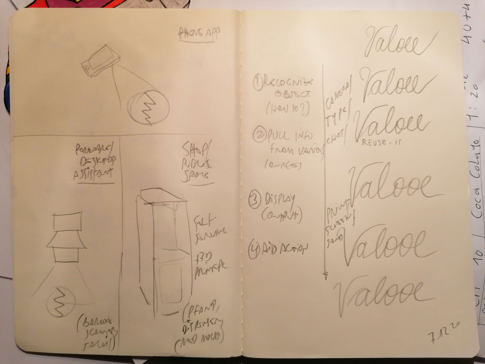
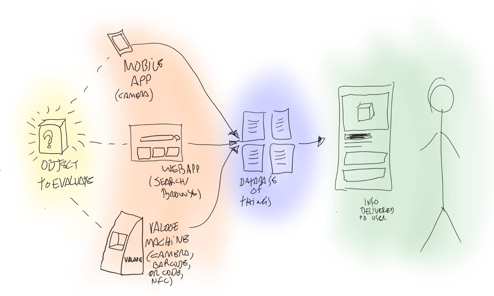

# E-I - evaluation interface

## Description

**E-I** is technology (hardware + software) to increase the ability to reuse products and materials. 

Drafting a basic prototype:

- User shows an object to E-I
- E-I compares images and other information collected from the product/object (weight, colors, barcode, QR code) against a database such as the [universal registry of things](../universal-registry/README.md)
- When information about the object is found, E-I retrieves it and delivers to the user
- When information about the object is not found, E-I allows the user to input information

For prototyping purposes, mock-ups of a workbench version of E-I can be constructed:

- With an articulated arm, a NFC sensor + arduino, and a screen showing a local website (perhaps running off a Raspbery Pi). NFC tags are added to pre-selected products.
- With an articulated arm, a Raspberry Pi with a camera and screen, and computer vision software to recognise predefined objects (different colors, maybe). Can [teachable machine](https://teachablemachine.withgoogle.com/) be used perhaps?
- With an articulated arm, a Raspberry Pi with camera, screen, microphone and speaker. The user can interact with E-I both via the camera and voice commands / feedback.

The goal with E-I at this point is not to develop a functional product, but rather to experiment with speculative use cases in order to discuss how  technologies might help interested parties reuse a larger proportion of materials that are currently discarded or kept out of use.  Other points of discussion are what would the implications of such technologies be in terms of use, privacy, health and safety, policy and economy.

Original concept:  [Point and Reuse](https://is.efeefe.me/concepts/point-reuse), created in previous phases of research.

## References

### [Monk - Ai-based inspection system](https://monkvision.ai/#how-it-works)

> Creating Trust whenever an item changes hands.

Repository [here](https://github.com/Tessellate-Imaging/monk_v1).

### [Formation "Agent valoriste"](https://ecossolies.fr/Formation-Agent-valoriste)

> Les professionnel.les du secteur du réemploi et du recyclage exercent des métiers variés : agent valoriste, chauffeur collecte, responsable boutique, opérateur de tri, vendeur … Chaque jour, ces professionnel.les contribuent à détourner de l’incinérateur des mètres cubes de matières. Leur rôle est aussi essentiel pour amener les citoyens et les entreprises à adopter des réflexes et des pratiques responsables en matière de tri et de consommation.
> Depuis 5 ans, les Ecossolies en lien avec les acteurs ESS du secteur « Réemploi/Ressources », forment des professionnels du secteur autour des principales fonctions du métier de valoriste :
>  - Collecter, trier, valoriser des objets, des matières
>  - Informer, orienter, sensibiliser aux enjeux du réemploi
>  - Travailler en réseau avec les acteurs agissant dans la prévention et la gestion des déchets.
> Les participants de la formation peuvent aussi bien être des agents opérateurs terrain, que des équipes d’encadrement et travaillent dans des filières d’activités différentes (textile, D3E, BTP, électro-ménager), et au sein de différentes structures : ressourceries, structure d’insertion, collectivités locales, associations de quartiers.
